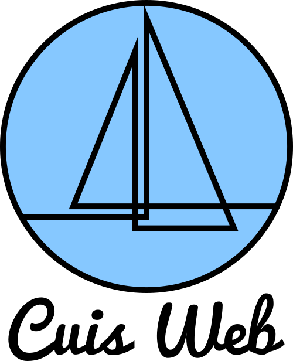

Cuis Web is a microframework web for [Cuis Smalltalk](https://github.com/Cuis-Smalltalk/Cuis-Smalltalk-Dev) that includes everything needed to create web applications according to the [Model-View-Controller (MVC) pattern](https://en.wikipedia.org/wiki/Model%E2%80%93view%E2%80%93controller).

## Getting Started

1. You'll need to download Cuis Smalltalk, you can follow the [official Cuis Smalltalk guide](https://github.com/Cuis-Smalltalk/Cuis-Smalltalk-Dev#setting-up-cuis-in-your-machine).
2. Once you have Cuis Smalltalk running you have to drag and drop the [Cuis-Web.pck.st](https://github.com/gstn-caruso/cuis-web/blob/master/Cuis-Web.pck.st) inside Cuis.

